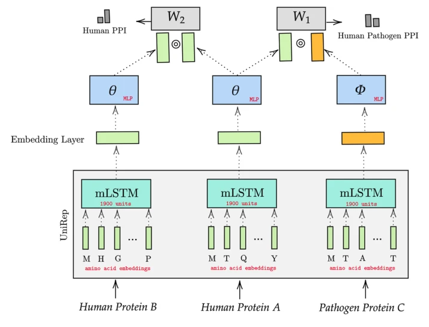
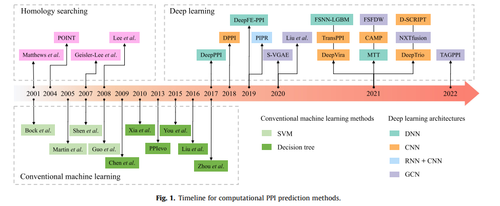
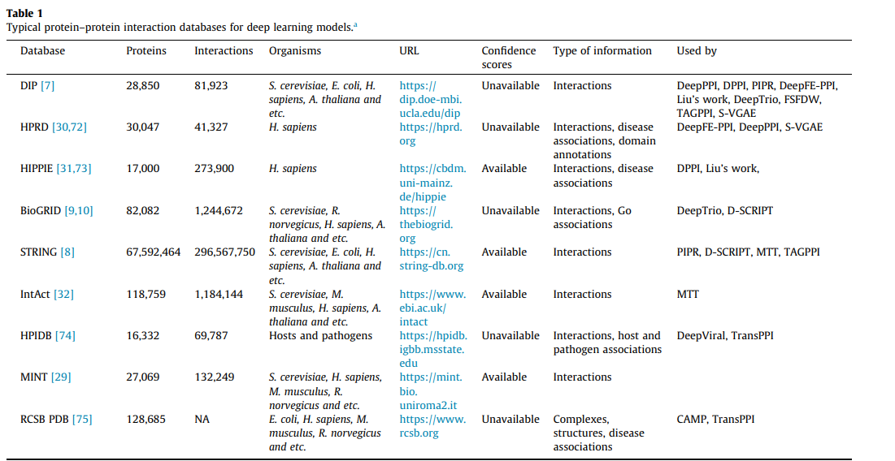
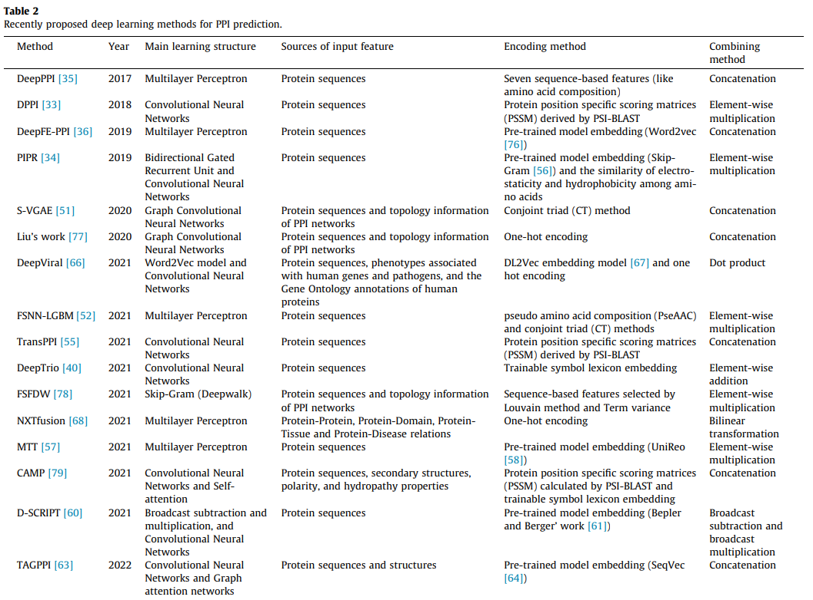
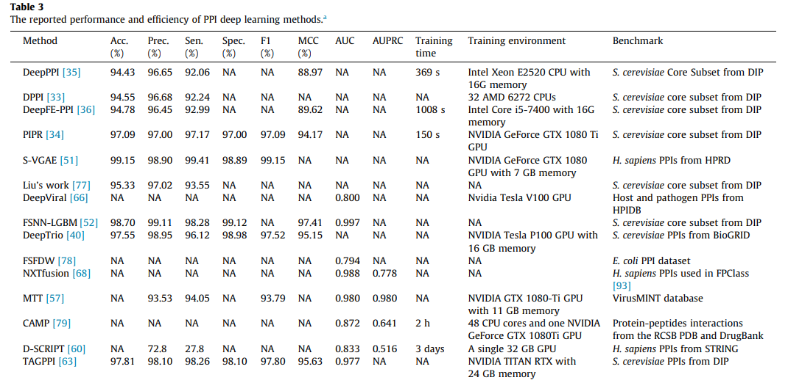

### Research Papers
1. DeNovo: Virus-host sequence-based protein-protein interaction prediction
<pre>
	i.) Database: VirusMentha 
	ii.) Achieved 81 to 86% accuracy on PPis of viral proteins that have no and distant sequence similarity to the ones used for training
	iii.) Negative sampling:
				Sequence based negative sampling
	iv.) 1:1::pos:neg
	v.) Models used support vector machines on hand crafted features(done by clustering based on physiochemical properties)
		   --> concatenate two protein features before giving it to model	
	vi.) Dataset: 5445 PPI between 2340 human proteins and 445 viral proteins, covering 172 ciral species in 28 subfamilies(After some filteration)
					Sequences from uniprot
	vii.) They tested random sampling, but it performe worst in inter species ppis, but well in intra-species ppis
		code and data: https://bioinformatics.cs.vt.edu/~alzahraa/denovo
</pre>

2. Deep Learning-Powered Prediction of Human-Virus Protein-Protein Interactions(Dec-2021): 
<pre>
	a. Negative sampling: Dissimilarity-Based Negative Sampling(A->B(sequence similarity > Threshold) , B->C(positive interaction) then A and C cannot be negative sample)
	b. Dataset imabalalance recommended to replicate real world scenario: 1:10 (has been proven reasonable to predict PPI)						
	c. Word2vec, Doc2vec and Node2vec
	d. Train on large human PPI, and later fine tune on specific PPI(eg. Human-SARs-Cov-2 PPIs)
	e. DeepVHPPI: First trained on supervised structure prediction, and then fine tune for PPI
	f. Alphafold-2 could be used for PPI 
</pre>

3. Deep Viral: prediction of novel virus-host interactions from protein sequences and infectious disease phenotypes(April-2021): 
<pre>
	a. Dataset sources: HPIDB, String, SARS-CoV-2 interatcions #332 PPI from 27 viral proteins(https://www.nature.com/articles/s41586-020-2286-9, Protein sequences retrieved from swiss-prot db)
        b. Negative sampling:
		i.) Dissimilarity-Based Negative Sampling
		ii.) randomly sample from postive sample and sequences similarity < 80 percent  
        c. Dataset imabalalance recommended to replicate real world scenario: 1:>2 (has been proven reasonable to predict PPI)
        d. Phenotype features + Sequences
        e. DL2Vec, W2V
        f. Keep test set completely different than train set(to prevent data leakage)
        g. Evaluation dataset sufferrs from several drawbacks
	h. Dataset szie: 24,678 positive interactions and 1,066 viral protein from 14 virus families and 292 virus taxa(length<=1000)
	 
</pre>

4. DWPPI- A Deep Learning Approach for predicting PPI in plants based multi-source information with a large scale biological network(March-2022): 
<pre>
        a. Dataset sources: Plant PPIs
        b. Negative sampling:
                i.) randomly sample   
        c. Dataset balance
        d. Bipartite graph + deepwalk --> CBOW-W2V(4-mer) --> 64 Dim -->LR,DT,
        e. Dataset size: 28110+81989+51514  positive interactions 

</pre>
5. Transfer Learning via multi-scale convolutional neural layers for human-virus ppi prediction(16 July-2021): 
<pre>
        a. Dataset sources: HPIDB, VirHostNet, VirusMentha, PHISTO, and PDB                                                                                                                    
        b. Dataset Target for fine-tuning: human-SARS-CoV-2-PPIs(568)
	c. Dataset construction procedure:
		i.) Remove ppi which detected only once
	       ii.) Remove non-physical interactions
	      iii.) Remove interaction between proteins without PSSM features	
	c. Negative sampling:
                i.) randomly sample--> Dissimlarity based negative sampling  
        c. Dataset imbalance(1:10)
	d. 5-fold CV                                                                                                   
        e. sequences -->PSSMs(Sequence profile)-->embedded vectors-->siamese CNN --> MLP --> prediction score 
        f. Dataset size: 31,381(9880 in HIV, 5966 in Herpes, 5099 in Papilloma, 3044 in Influenze, 1300 in Hepatitis, 927 in Dengue, 709 in Dengue)                                                                              
	g. Accuracy: 93%
	i. Dataset available: https://github.com/XiaodiYangCAU/TransPPI/tree/main/sample
	j. Ensemble of 5 models(AvgX)
	k. Intersting to read how they divided dataset and fine tuned it and also the result analysis part
</pre>

6. LSTM-PHV: prediction of human-virus protein-protein interactions by LSTM with word2vec: 
<pre>
    a.Here we cloned, tagged and expressed 26 of the 29
	  SARS-CoV-2 proteins in human cells and identifed the human proteins that physically
	  associated with each of the SARS-CoV-2 proteins using afnity-purifcation mass spectrometry,
	  identifying 332 high-confdence protein–protein interactions between SARS-CoV-2 and human proteins
	b. Database: HPIDB 3.0
	        How dataset was created?
				--> MI score >= 0.3 are kept. MI score is the confidence score assigned to each PPI from <b>Intact</b> and <b>VirHostnet</b>
				--> Redundant PPIs were excluded by using CD-HIIT with an identity threshold of 0.95
				--> Removed proteins of length less than 30 and more than 1000<b>(30 <= len(proteins) <= 1000)</b>
	c. Negative sampling:
			Dissimilarity based negative sampling method: Read Denovo paper and this paper again for full understanding
														Really nice way to do it
	d. Dataset size: 22,383 positive pairs (5882 human and 996 virus proteins) from HPIDB 
					 7371 positive pairs of SARS-cov3 and human  from BIOGRID(Covid-19 coronavirus project 4.3.195)	
					 8412 PPis human and nonviral pathogens (3317 human proteins and 3068 virus proteins)(only for testing)
	e. Dataset and API: http://kurata35.bio.kyutech.ac.jp/LSTM-PHV/introduction_page
	f. Model:  LSTM-->Concatante --> FC -->prediction
				Weighted cross entropy to deal with imbalance dataset, early stopping
	g. Metrics used to evaluate: MCC,F1,AUPRC,ACC, SN,SP
	i. Check the graphs for output visualization, could be useful
				--> UMAP clearly visualizes the positive samples and negative samples difference
</pre>

7. Transfer Learning for predicting virus-host protein interactions for novel virus sequences
<pre>
	a. Database: i.) Virus-host dataset from HPIDB(22,653-pairs)--> Training
				 ii.) SARs-cov-2-human interaction positive pairs from BioGrid(13,947 pairs) --> only for test
				iii.) H1V1 - human interaction pairs(10,955 positive pairs except virus H1V1-human in train set and 381 true PPI, 381 negative between             H1V1 		and     Human for test set)
				iv.) Ebola - human interaction pairs(11,341 positive pairs except virus Ebola-human in train set and 150 true PPI,150 negative between Ebola and 	Human for test set)
				v.) Barman paper dataset(testing dataset is not completely unseen)--> Collected from VirusMint DB--> (1036 positive + 1036 negative pairs between 160 virus proteins and 667 human proteins)
				vi.) denovo paper dataset: Dataset with protein motif information
											Training set: 1590 pos, 1515 neg with virus SLim sequence
											Test set: 425 posiitives, 425 negatives
											Negative sampling based on distance
				vii.) Bacteria-Human PPIs:  HPIDB DB
											Bacillus anthracus: 3057 PPIs
											Yersinia Pestis: 4020 PPIs
											Franciselia Tularensis: 1346 PPIs	 

										 

					<b>Note: All datasets are available</b>

	b. Negative sampling:
			Dissimilaroty-based negative sampling
	c. 1:10 positive:negative ratio
	d. Model:
			BERT trained on LM + trained on structure prediction  and contact predeciton and then fine tune for ppi tasks
			Compared their model results with 7 other models
	d. Dataset: wget https://www.cs.virginia.edu/yanjun/jack/ppi/deepvhppi.tar.gz
				tar -xvf deepvhppi.tar.gz
</pre>

8. A mulitask transfer learning framework for the prediction of virus-human protein-protein interactions
<pre>
	a. Train on intra-species ppi and test on interspecies(virus-human)(Reason to use human-human ppis are given in the paper, good to write in thesis)
	b. Database: 
				i.) APID, IntAct, VirusMetha, UniProt (collected from these DB using PSICQUIC web service)--> <b>11941</b> curated and experimented PPIs(246 viruses and human)--> From this Novel H1N1-Human PPIs and Novel Ebola-Human PPIs data generated	
					 Note: Positve training data for the Novel H1N1 includes PPIs between human and all viruses except H1N1(same for Ebola)				  				 
				ii.) DeepViral Paper Leave-one-species-out-benchmark datasets: Dataset retrived from <b>HPIDB</b> DB to include all Pathogen-Host interactions that have confidence scores available and are associated with an existing virus family in the NCBI taxonomy: <b>24,678 PPIs</b>(1066 virus protein from 14 families)

					Note: Negative tesing and training dataset were created from all the virus and 16,627 human protein from uniprot(not present in training set)

				iii.) H1V1 - human interaction pairs(10,955 positive pairs except virus H1V1-human in train set and 381 true PPI, 381 negative between             H1V1 		and     Human for test set): They did not use this because negative dataset is based on distance based
				iv.) Ebola - human interaction pairs(11,341 positive pairs except virus Ebola-human in train set and 150 true PPI,150 negative between Ebola and 	Human for test set): They did not use this because negative dataset is based on distance based
				v.) Barman paper dataset(testing dataset is not completely unseen) (1036 positive + 1036 negative pairs)
				vi.) denovo paper dataset: Dataset with protein motif information
											Training set: 1590 pos, 1515 neg with virus SLim sequence
											Test set: 425 posiitives, 425 negatives
											Negative sampling based on distance
				vii.) Intra human PPI: From InACT(<b>96,458 PPIs</b>), only contaings human proteins which appears in the dataset of virus-human proteins
				
	b. Negative sampling:
			Three methods:	i.) Random sampling
							Not used Dissimilarity-based method because it is biased as they restrict the number of tested human proteins
							
	c. 1:10 positive:negative ratio
	d. Model:
			i.) classification for human-virus ppi and regression for human-human ppi(string database data for regression)
			ii.) Combined loss function: Cls. loss + weight*Reg. loss
	e. Compared their models results with:	
		i.) Generalized and Denovo methods: based on hand crafted input features and trained on SVM
		ii. ) Doc2vec and MOTIFTRANSFORMER: based on sequence embedding
		iii.) Barmen's paper: based on domain-domain association 
	f. Dataset and code: https://git.l3s.uni-hannover.de/dong/multitask-transfer
</pre>

9. Cross-attention PHV: Prediction of human and virus protein-protein interactions using cross-attention-based neutral networs(Oct-2022): 
<pre>
    a. Max protein sequences length =9000 (1D CNN to the W2V generated feature matrices reduced computational costs, thus allow longer length sequences)
	b. Database: i.) Denovo dataset(Train: 5024 positive ppis and 4734 negative
								Test: 425 positive and 425 negative)
				ii.) Human-unknown virsus from HVIDB DB
				iii.) Human-SARS-Cov2 PPI dataset from  BIOGRID DB(14218 Positive PPIs)
	c. Model: 
			W2V --> 1D CNN --> Cross Attention --> FC --> Softmax
	d. Best results among all above methods

	Web-api: http://kurata35.bio.kyutech.ac.jp/Cross-attention_PHV/
	data: https://github.com/kuratahiroyuki/cross-attention_PHV
</pre>

10. Review on Deep Learning frameworks for protein-protein interaction prediction(15th June 2022): 
<pre>
    a. Max protein sequences length =9000 (1D CNN to the W2V generated feature matrices reduced computational costs, thus allow longer length sequences)
	b. Database: i.) 
Negatome(for negative ppis)

				ii.) Human-unknown virsus from HVIDB DB
				iii.) Human-SARS-Cov2 PPI dataset from  BIOGRID DB(14218 Positive PPIs)
	c. Model: 
			W2V --> 1D CNN --> Cross Attention --> FC --> Softmax
	d. Best results among all above methods

	Web-api: http://kurata35.bio.kyutech.ac.jp/Cross-attention_PHV/
	data: https://github.com/kuratahiroyuki/cross-attention_PHV
</pre>

10. A SARS-CoV-2 protein interaction map reveals targets for drug repurposing(Nature articles-Gold Standard): 
<pre>
    a.Here we cloned, tagged and expressed 26 of the 29
	  SARS-CoV-2 proteins in human cells and identifed the human proteins that physically
	  associated with each of the SARS-CoV-2 proteins using afnity-purifcation mass spectrometry,
	  identifying 332 high-confdence protein–protein interactions between SARS-CoV-2 and human proteins
	b. MIST> 0.75
	c. SARS sequence from GenScript
</pre>

10. ProteinNet: a standardized dataset for ml of protein structure 
<pre>
    a. Based on sequence identity
</pre>
10. Deep ppi codes and dataset 
<pre>
    a. https://github.com/gdario/deep_ppi
</pre>

	
### Database Information
1. HPIDB 2.0: 45,238 manually curated entries PPI
2. HVIDB: 48,643 experimentally verified human–virus PPIs covering 35 virus families, 6633 virally targeted host complexes, 3572 host
dependency/restriction factors as well as 911 experimentally verified/predicted 3D complex structures of human–virus PPIs.
Furthermore, our database resource provides tissue-specific expression profiles of 6790 human genes that are targeted by
viruses and 129 Gene Expression Omnibus series of differentially expressed genes post-viral infections(Collected) 

### Dataset Information

### Models

### Task with date

